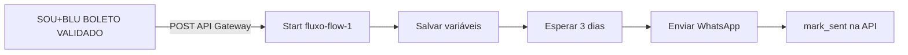

# Pós-venda — `fluxo-flow-1` (cs-call-1)

Editor: https://integracoes.hyperflow.global/apps/cs-call-1/flows/fluxo-flow-1

## Objetivo

Quando a proposta vira **BOLETO VALIDADO** no SOU+BLU → Hyperflow espera **3 dias** → envia WhatsApp de pós-venda → marca como enviado na base.

## Arquitetura (push + espera)



Payload flat que o SOU+BLU já envia (use `{{input.*}}`):

- `telefone`, `phone1`, `nome`, `cpf`, `numero`, `mensagem`, `id`, `validated_at`, `follow_up_at`

---

## Parte 1 — API Gateway (obrigatório para o push)

1. No app **cs-call-1** → **API Gateway** → **+**
2. Método: **POST**
3. Rota: `boleto-validado` (ou similar)
4. Fluxo: **fluxo-flow-1**
5. Segurança: **Restringir clientes** (opcional) → criar Cliente → copiar o ID
6. Copiar o **Endpoint** da rota (não o link do editor)

Colar no servidor (`config.boleto.local.php`):

```php
define('BOLETO_WEBHOOK_URL', 'COLE_O_ENDPOINT_AQUI');
define('BOLETO_HYPERFLOW_CLIENT_ID', 'COLE_O_CLIENT_ID_SE_HOUVER');
```

---

## Parte 2 — Montar o fluxo (nós)

### 1) Start
- Já existe. É o gatilho do API Gateway.

### 2) Variável de fluxo — `salvar payload`
Criar/sobrescrever:

```json
{
  "id": "{{input.id}}",
  "telefone": "{{input.telefone}}",
  "nome": "{{input.nome}}",
  "cpf": "{{input.cpf}}",
  "numero": "{{input.numero}}",
  "mensagem": "{{input.mensagem}}"
}
```

### 3) Esperar — `aguardar 3 dias`
- Tipo: **Estática (STATIC)**
- Valor: **3**
- Unidade: **dias**

> **Para testar agora:** use **1 minuto** (STATIC). Depois volte para 3 dias.

### 4) Enviar mensagem (WhatsApp)
- Texto: `{{flow.mensagem}}`
- Destino / ativar usuário: número `{{flow.telefone}}` (formato com DDI se o canal exigir, ex. `55{{flow.telefone}}`)

Se o canal exigir Ativar usuário antes:
- Nó **Ativar usuário** com telefone `55{{flow.telefone}}` → depois **Enviar mensagem**.

### 5) Requisição REST — `mark_sent`
- Método: **POST**
- URL: `https://www.soumaisblu.com.br/api/hyperflow-boleto.php?action=mark_sent`
- Headers:
  - `Content-Type`: `application/json`
  - `X-API-Key`: `<API_INTERNAL_KEY do SOU+BLU>`
- Body:

```json
{ "id": "{{flow.id}}" }
```

### 6) (Opcional) Comentário interno
`Pós-venda enviado — proposta {{flow.numero}} / {{flow.nome}}`

---

## Teste rápido (sem esperar 3 dias)

1. No nó Esperar: **1 minuto**
2. No SOU+BLU: valide um boleto de teste **ou** chame:

```http
POST https://www.soumaisblu.com.br/api/boleto-webhook.php?action=notify
X-API-Key: <token>
Content-Type: application/json

{
  "id": "ID_PROPOSTA_REAL",
  "force": true
}
```

(Se `notify` exigir payload da proposta já no sistema, basta mudar status para BOLETO VALIDADO na tela.)

3. Confirme no Hyperflow a execução do fluxo
4. Após 1 min, confira WhatsApp + `mark_sent`

---

## Alternativa: Schedule (puxa da base)

Se preferir não usar push:

1. **Agendamento** — todos os dias 09:00
2. **REST GET** `https://www.soumaisblu.com.br/api/hyperflow-boleto.php?action=due&days=3` + `X-API-Key`
3. Loop em `{{input.body.items}}` (ou path que o Hyperflow expuser)
4. WhatsApp com `telefone` / `mensagem`
5. REST `mark_sent` com `id`

Para teste do pull: `action=list` (todos) ou `due&days=0` se habilitado.
